# Optimise and Secure AWS HTTP API Gateway by locking down direct access

*Cloud | 17 Nov | Written By Vimal Paliwal*


*Photo by Growtika on Unsplash*

AWS HTTP API Gateway lets you deploy RESTful API quickly in the most affordable way without compromising on basic security, performance, scalability and observability but unlike REST API Gateway lacks many advanced features such as WAF attachment, resource policy, API key management, caching, canary deployments, request body transformation, X-Ray tracing, etc.

AWS WAF is a vital resource to secure publicly exposed endpoints from various types of attacks and because HTTP API Gateway does not support WAF association natively, we need to create a CloudFront distribution and use it as an entry point to the HTTP API Gateway.

Even after implementing the above resources, we aren't fully secure because if a bad actor can discover our HTTP API Gateway URL, they can bypass WAF and our API becomes highly vulnerable to attacks. Hence, in this article we will learn how to lock down direct access to HTTP API Gateway URL.

The implementation is very simple and straightforward so let's get started.

## HTTP API Gateway

Let's navigate to API Gateway in AWS management console to launch a new HTTP API Gateway and click on the Build button available with the HTTP API container.

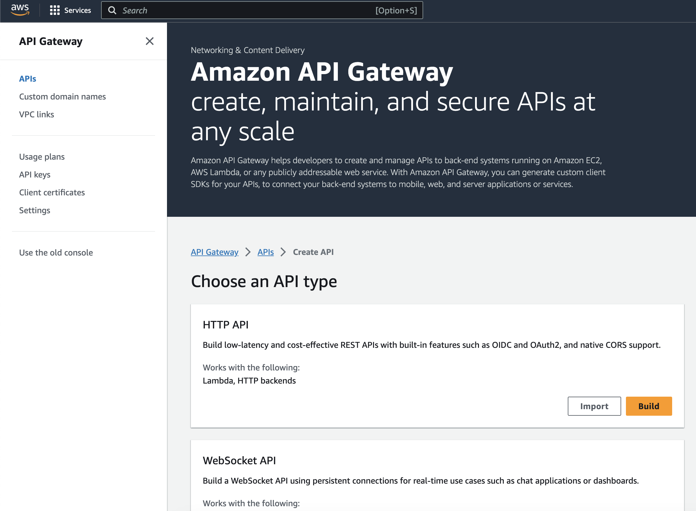
*Fig 1. API Gateway Dashboard*

Upon clicking on the Build button we will be taken to a page that consists multiple steps before we can spin up an API gateway.

### Step 1 - Create API:

- Click on Add Integration button
- Select HTTP as the integration type and GET as the method type
- Under URL endpoint, I am using a mock endpoint that I created using beeceptor which returns a fixed response
- Finally, give your API gateway a name and click Next

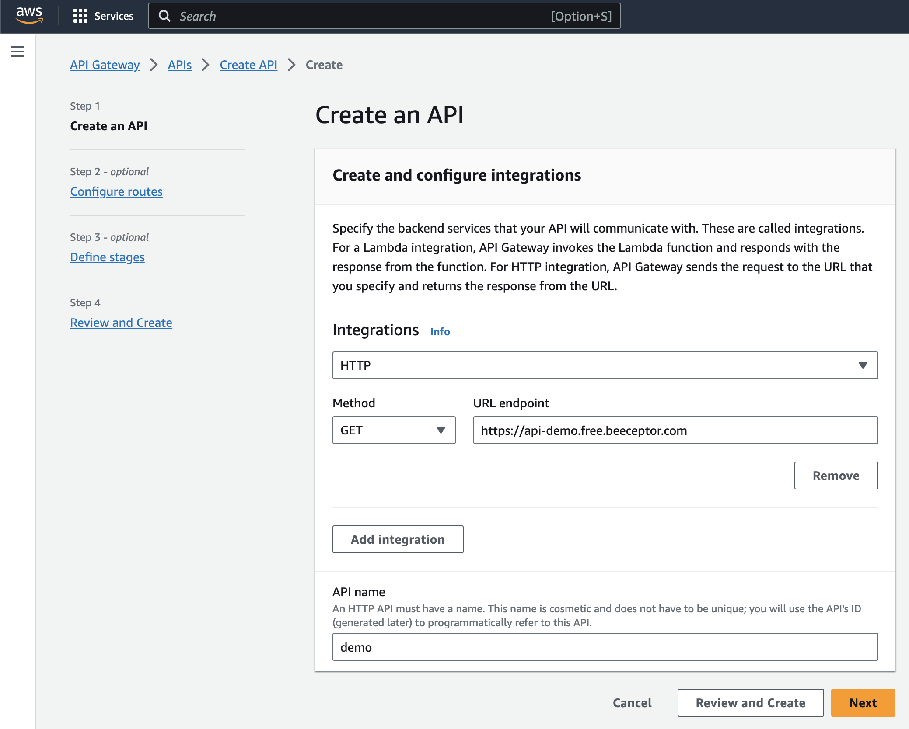
*Fig 2. HTTP API - Create API*

### Step 2 - Configure Routes:

- Select GET as method and / as resource path
- From the target dropdown, select the Integration that we created in the Step 1 and click Next

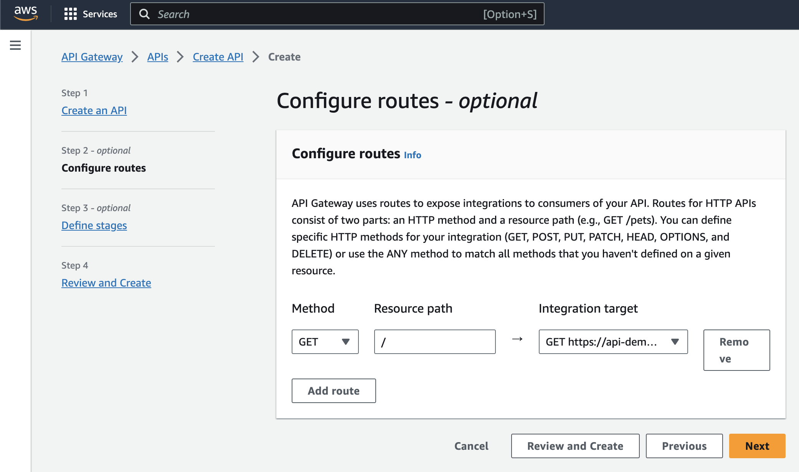
*Fig 3. HTTP API - Routes*

### Step 3 - Define stages

We can leave $default as the stage name and auto-deploy enabled and click Next

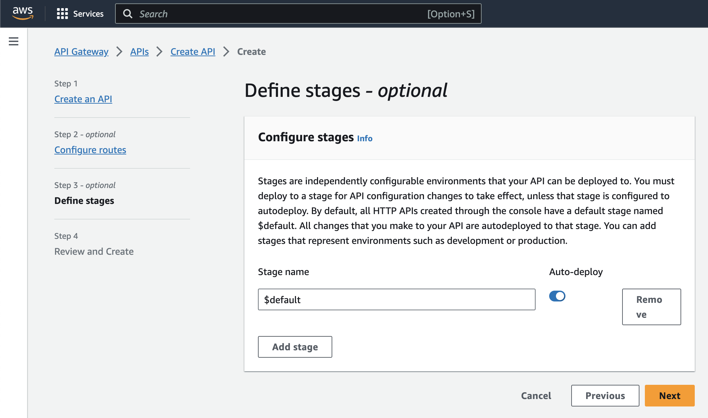
*Fig 4. HTTP API - Define stages*

In the last step, review all the inputs and click Create button if everything looks good.

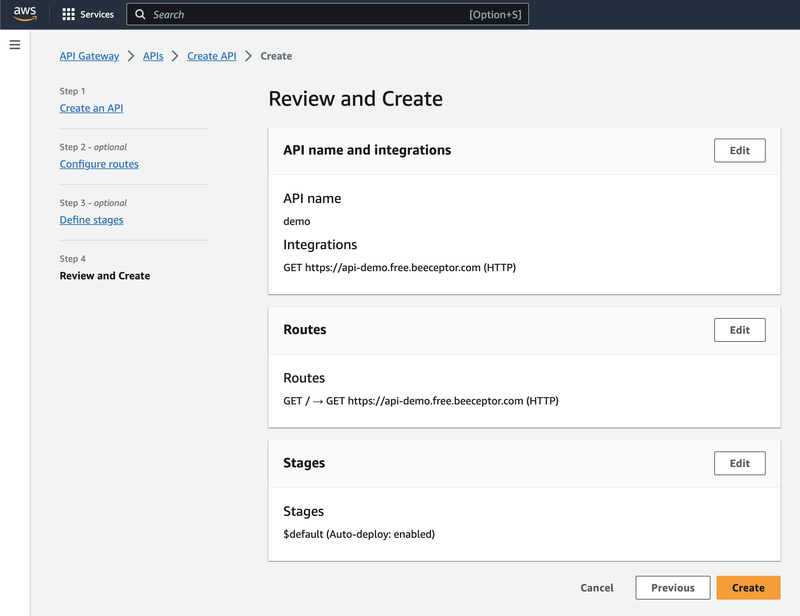
*Fig 5. HTTP API - Review*

Our API Gateway is now ready to accept incoming connections but we want to use CloudFront as the entry point to our API as it provides a global endpoint rather than a regional endpoint so let's create a CloudFront distribution.

## CloudFront

Let's navigate to CloudFront console and create a distribution for our API Gateway. Required values for each parameter is mentioned below per section. Optional fields can be left blank or filled as per your requirement.

### Section 1: Origin

- **Origin domain**: API Gateway domain
- **Protocol**: HTTPS
- **Minimum SSL protocol**: TLSv1.2 (default)

Under **Add custom header**, click on Add header button. We will add a custom header which CloudFront will forward to API Gateway for every request and we will validate the header for every request using Lambda Authorizer that we will create in the next step.

Header name can be `x-cf-api-gateway-token` and value will be a long random string making it difficult for hackers to guess. It is not mandatory to choose the header name I suggested earlier so feel free to change it as per your convenience.

### Section 2: Default cache behaviour

- **Compress objects automatically**: Yes
- **Viewer protocol policy**: Redirect HTTP to HTTPS
- **Allowed HTTP methods**: GET, HEAD
- **Restrict viewer access**: No
- **Cache policy**: CachingDisabled
- **Origin request policy**: AllViewerExceptHostHeader

**Note**: We can skip the Function associations, WAF and Settings sections completely and stick to the default values for these sections for this demo and create the distribution.

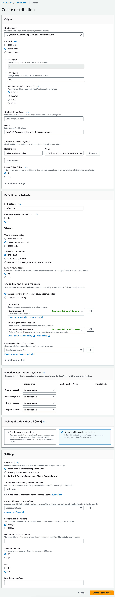
*Fig 6. CloudFront Distribution*

Let's also store the above created token in SSM Parameter store as a SecretString so that we can validate it later using Lambda Authorizer.

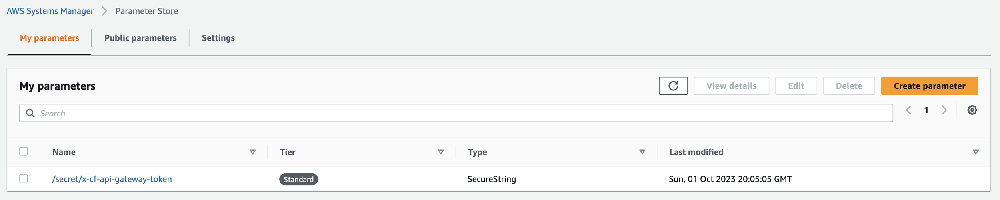
*Fig 7. SSM Parameter*

We are almost close to achieving our target. Our last step is to create a Lambda Authorizer for our API Gateway that will validate the token received in the custom header for every request and decide whether to allow the request or not.

## Lambda Authorizer

Before we create a Lambda function, we need to create an IAM role that will allow the function to read the SSM parameter that we created earlier.

### assume-role-policy-doc.json
```json
{
  "Version": "2012-10-17",
  "Statement": [
    {
      "Effect": "Allow",
      "Principal": {
        "Service": "lambda.amazonaws.com"
      },
      "Action": "sts:AssumeRole"
    }
  ]
}
```

```bash
aws iam create-role --role-name api-cf-demo-role --assume-role-policy-document file://assume-role-policy-doc.json
```

Now, let's create an inline policy that will allow the role to read value from SSM parameter.

### ssm-access-policy.json
```json
{
  "Version": "2012-10-17",
  "Statement": [
    {
      "Effect": "Allow",
      "Action": "ssm:GetParameter",
      "Resource": "arn:aws:ssm:AWS_REGION:AWS_ACCOUNT_ID:parameter/SSM_PARAMETER_NAME"
    }
  ]
}
```

```bash
aws iam put-role-policy --role-name api-cf-demo-role --policy-name ssm-access --policy-document file://ssm-access-policy.json
```

**Note**: Make sure to replace the placeholders in the above policy with their actual values before creating the inline policy.

Along with this inline policy, we also need to attach an AWS managed policy to this role so that lambda can write logs to CloudWatch logs.

```bash
aws iam attach-role-policy --policy-arn arn:aws:iam::aws:policy/service-role/AWSLambdaBasicExecutionRole --role-name api-cf-demo-role
```

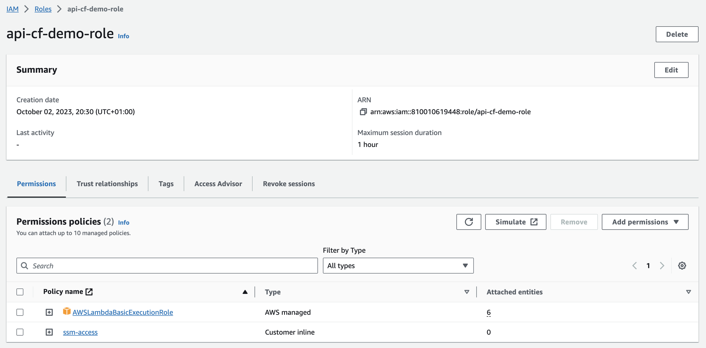
*Fig 8. Lambda IAM Role*

Cool, we now have the IAM role that we need for our Lambda function so let's navigate to Lambda console and create the function. Feel free to give an appropriate name to the function, select Python 3.11 as the function runtime, x86_64 for the architecture and for execution role select the IAM role that we just created.

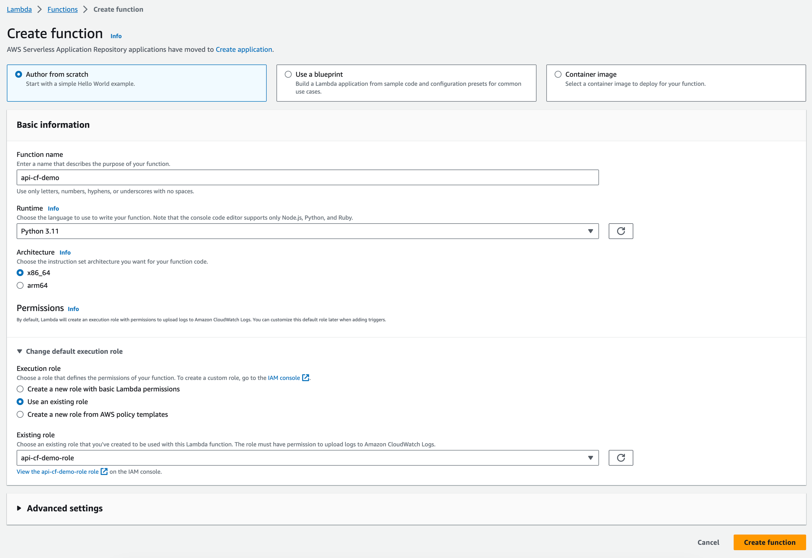
*Fig 9. Lambda Function*

Once the function is created, replace the Lambda code with the below provided code. The below code will read token from the SSM parameter and validate it with the token received from the CloudFront. If both matches, it will return a JSON object that will instruct API Gateway to allow the request.

Next, we need to add an environment variable to the Lambda function so go to Configuration > Environment variables and add a new variable with key as `SSM_PARAMETER_NAME` and value as the name of SSM Parameter that we created earlier to store the token.

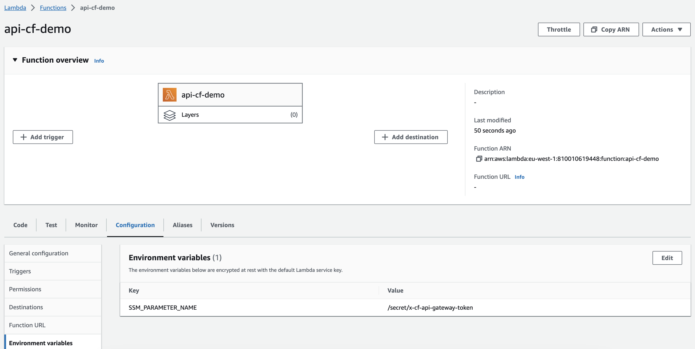
*Fig 10. Lambda Environment Variables*

Great, our Lambda function is ready to be attached to the API Gateway as an authorizer so let's navigate back to API Gateway and do the same by following the below steps.

On the API Gateway page, click on Authorization in the left panel and switch to Manage authorizers tab.

- Click on Create authorizer and select Lambda as the type
- Give the authorizer a name and select the region you created the lambda function and the lambda function from the dropdown
- In case you don't see a dropdown, start typing the lambda function name and the dropdown should appear
- The Payload format version and Response mode can stay as it is but let's disable Authorizer caching and remove the pre-filled Identity source
- Under Invoke permissions section, make sure the switch is enabled so that API gateway can automatically create a resource policy and attach it to the lambda function. This policy will allow API gateway to invoke the lambda function.

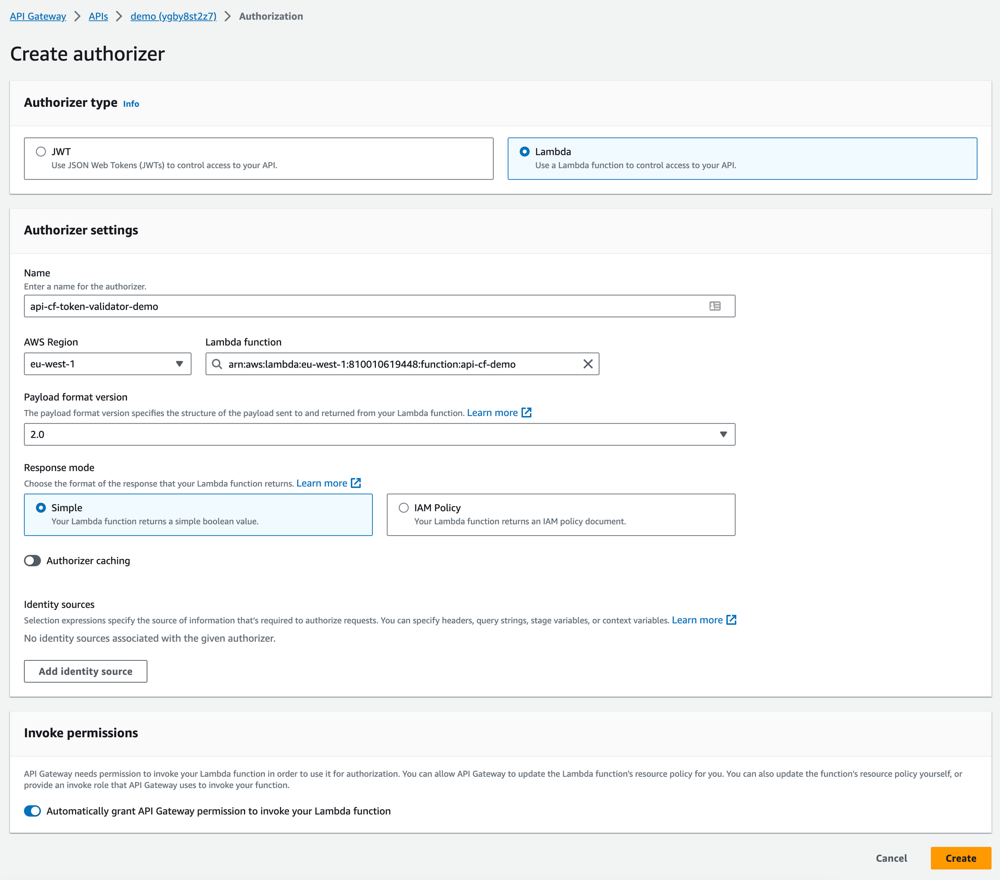
*Fig 11. API Gateway Lambda Authorizer*

**Note**: Sometimes API gateway might not add resource policy to the lambda function and because of this we won't get the desired result hence, before proceeding further go the lambda function and verify if the resource policy is attached to it. In case it isn't, run the following command to attach the required resource policy:

```bash
aws lambda add-permission --function-name FUNCTION_NAME --source-arn arn:aws:execute-api:AWS_REGION:AWS_ACCOUNT_ID:API_GW_ID/authorizers/AUTHORIZER_ID --principal apigateway.amazonaws.com --statement-id AllowAPIGatewayAuthorizerAccess --action lambda:InvokeFunction
```

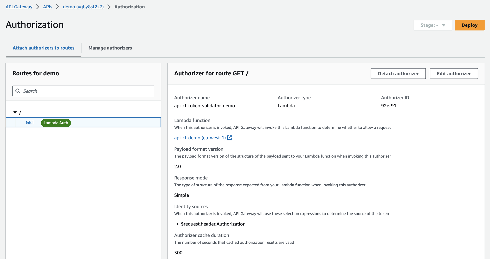
*Fig 12. Lambda Function Resource Policy*

Next, let's attach the authorizer to the route that we create in the beginning so let's switch to the Attach authorizers to routes tab, select the GET path within the route and attach the lambda authorizer that we just created.

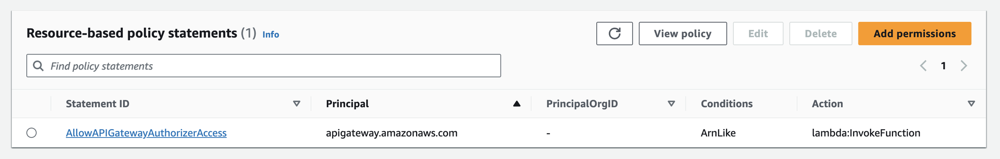
*Fig 13. API Gateway Route Authorizer*

This completes our implementation of locking down direct access to API gateway and preventing users from bypassing WAF implemented on CloudFront. Let's test the implementation before saying adios.

## Testing

It's very simple to test the implementation. Simply visit both the API Gateway and the CloudFront URL and you will notice that API Gateway throws Forbidden error whereas CloudFront returns a message.

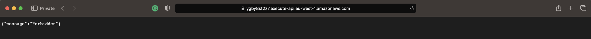
*Fig 14. API Gateway Test URL*

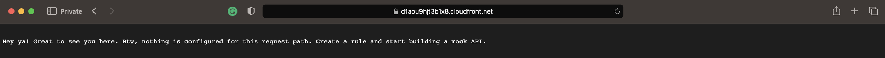
*Fig 15. CloudFront Test URL*

**Bravo! Mission accomplished!**

## Covering the basics

### How do I protect my HTTP API gateway?

There are various ways to protect AWS HTTP API Gateway such as attaching SSL certificates, using the latest TLS protocol version, applying API requests throttling, using authorizers, associating WAF and so on.

### How do I protect my AWS API Gateway from DDoS?

AWS API Gateway by default includes basic DDoS protection which is provided via AWS Shield and you can further uplift the security of your APIs by attaching WAF and for highest level of protection you can subscribe to AWS Shield Advanced.

### Which authentication methods can I use to secure API Gateway?

AWS HTTP Gateway supports three different ways for authenticating the requests. You can use IAM authorizer and manage access to the API for the users that can access to AWS account. For wider audience, you can create either a JWT authorizer or a lambda authorizer type for custom authentication logic.

---

**Tags**: AWS API Gateway, CloudFront, Security

**Author**: Vimal Paliwal

Vim brings over eight years of practical experience in designing and deploying cloud-native solutions using AWS and a broad spectrum of DevOps tools. Throughout his career, he has collaborated with businesses of all sizes to build secure, scalable, and efficient infrastructure on the cloud, often leading strategic cloud transformation initiatives. He is a part of the AWS Community Builders program, where he actively contributes to knowledge-sharing efforts across the cloud ecosystem by writing on real-world implementations and best practices. In addition, Vim has spent several years as an AWS Authorized Instructor, during which he trained over 1,000 professionals.

---

*Source: [SkildOps Blog](https://skildops.com/blog/optimise-and-secure-aws-http-api-gateway-by-locking-down-direct-access)*
